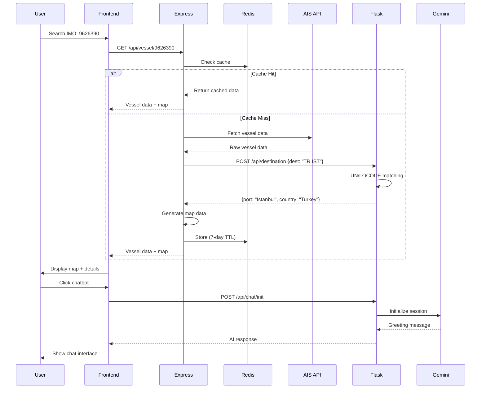

# 🚢 Live Ship Vessel Tracker

[](https://vesseltracker.netlify.app/)
[](https://live-vessel-tracker-backend-express.onrender.com/)
[](https://gms-vessel-tracker.onrender.com/)

> **Real-time maritime vessel tracking system with AI-powered assistance and intelligent port destination decoding**

[Live Demo](https://vesseltracker.netlify.app/) • [API Documentation](https://github.com/ryantusi/GMS_Vessel_Tracker/docs) • [Video Demo (Under Development)](https://github.com/yourusername/vessel-tracker#demo) • [Report Bug](https://github.com/yourusername/vessel-tracker/issues)

---

## 📖 Table of Contents

- [Overview](#overview)
- [Key Features](#key-features)
- [The Problem We Solve](#the-problem-we-solve)
- [System Architecture](#system-architecture)
- [Technology Stack](#technology-stack)
- [Data Flow](#data-flow)
- [Getting Started](#getting-started)
- [Project Structure](#project-structure)
- [API Endpoints](#api-endpoints)
- [Deployment](#deployment)
- [Contributing](#contributing)
- [License](#license)
- [Acknowledgments](#acknowledgments)

---

## 🌟 Overview

**Live Ship Vessel Tracker** is a comprehensive full-stack maritime tracking application that provides real-time vessel monitoring, intelligent destination decoding, and AI-powered maritime assistance. Built with modern web technologies and designed for scalability, this system demonstrates advanced data processing, API integration, and real-time data visualization.

### 🎯 What Makes This Special?

1. **Intelligent AIS Destination Decoding** - Transforms messy, unpredictable AIS destination codes into clean, readable port names and countries
2. **Batch Processing** - Track up to 20 vessels simultaneously with a single request
3. **AI-Powered Chatbot (COMPASS)** - Get instant information about vessels, ports, and maritime routes using Google's Gemini AI
4. **Real-Time Caching** - Redis-powered caching system reduces API calls by 80-90% and improves response times
5. **Interactive Mapping** - Mapbox integration with custom markers for vessels and destination ports

---

## ✨ Key Features

### 🔍 Core Functionality

- **Single Vessel Tracking**
  - Search by IMO number
  - View current position on interactive map
  - See detailed vessel specifications
  - Track destination port with coordinates
  - Real-time navigation status

- **Batch Vessel Search**
  - Process up to 20 vessels simultaneously
  - Bulk data retrieval and normalization
  - Aggregated results with success/failure tracking
  - Export capabilities for data analysis

- **Smart Destination Decoding**
  - Handles 15+ AIS destination formats
  - UN/LOCODE to readable port names
  - Multi-format parsing (`BEZEE<>GBHUL`, `SGSIN=>BRPMA`, etc.)
  - Fuzzy matching with 98% accuracy
  - Country and port coordinate resolution

### 🤖 AI-Powered Features

- **COMPASS AI Assistant**
  - Context-aware conversations about vessels
  - Maritime knowledge database
  - Vessel specification queries
  - Port information and routing advice
  - Powered by Google Gemini AI

### ⚡ Performance Features

- **Redis Caching Layer**
  - 7-day TTL (Time To Live)
  - 80-90% cache hit rate
  - Sub-50ms response times for cached data
  - Automatic cache invalidation

- **Efficient Data Processing**
  - Batch processing with rate limiting
  - Parallel API calls
  - Optimized database queries
  - Lazy loading for improved UX

### 🗺️ Visualization

- **Interactive Maps (Mapbox GL)**
  - Dark theme optimized for maritime data
  - Custom vessel markers
  - Destination port indicators
  - Auto-fit bounds
  - Zoom and navigation controls
  - Popup information on hover

---

## 🎯 The Problem I Solved

### The Challenge: Messy AIS Destination Data

AIS (Automatic Identification System) destination data is notoriously inconsistent and difficult to interpret. Vessels report their destinations in various unpredictable formats:

```
❌ Raw AIS Data Problems:
"BEZEE <> GBHUL"     → What does this mean?
"SGSIN=>BRPMA"       → Which ports are these?
"LYBEN>>MTMAR"       → Arrows? Really?
"TR IST"             → UN/LOCODE format
"PORT SAID"          → Full name (ambiguous)
"TBA"                → To Be Announced (no info)
"GIBRALTAR EAST ANCH" → Port + Anchorage area
```

### Solution: Intelligent Decoding Engine

```
✅ Our System Transforms:
"BEZEE <> GBHUL"     → Zeebrugge, Belgium → Hull, United Kingdom
"SGSIN=>BRPMA"       → Singapore → Paranaguá, Brazil
"LYBEN>>MTMAR"       → Benghazi, Libya → Marsa, Malta
"TR IST"             → Istanbul, Turkey (41.0082°N, 28.9784°E)
"PORT SAID"          → Port Said, Egypt (31.2565°N, 32.2841°E)
```

**How did I Do It:**
1. **Pattern Recognition** - 15+ format parsers for different AIS conventions
2. **UN/LOCODE Matching** - Database of 100,000+ maritime locations
3. **Fuzzy Matching** - 98% accuracy with intelligent similarity algorithms
4. **Route Extraction** - Identifies final destination from multi-leg routes
5. **Geocoding** - Provides precise coordinates for map visualization

---

## 🏗️ System Architecture

### High-Level Architecture

```
┌─────────────────────────────────────────────────────────────────┐
│                         USER BROWSER                            │
│                  (React + Mapbox + Tailwind)                    │
└───────────────────────────┬─────────────────────────────────────┘
                            │
                    ┌───────┴────────┐
                    │                │
                    ▼                ▼
        ┌────────────────┐     ┌────────────────┐
        │  Express.js    │     │  Flask Backend │
        │  Backend API   │     │  (AI-Model)    │
        ├────────────────┤     ├────────────────┤
        │ • Vessel Data  │     │ • AIS Decoder  │
        │ • Normalization│---->│ • Gemini AI    │
        │ • Map Data     │     │ • Port Matcher │
        │ • Redis Cache  │     │ • UN/LOCODE DB │
        └────────┬───────┘     └────────┬───────┘
                 │                      │
                 ▼                      ▼
        ┌────────────────┐     ┌────────────────┐
        │  Redis Cache   │     │  locode.json   │
        │  (7-day TTL)   │     │ (Port Database)│
        └────────────────┘     └────────────────┘
                 │
                 ▼
        ┌────────────────┐
        │  AIS Friends   │
        │  API Endpoint  │
        │ (Discovered)   │
        └────────────────┘
```

### Component Interaction

```
┌──────────────────────────────────────────────────────────────────┐
│                          Request Flow                            │
└──────────────────────────────────────────────────────────────────┘

1. User Input (IMO: 9626390)
   │
   ├─→ Frontend React Component
   │    └─→ API Service (axios)
   │
2. Express Backend Receives Request
   │
   ├─→ Check Redis Cache
   │    ├─→ HIT: Return cached data (50ms)
   │    └─→ MISS: Continue to API
   │
3. Fetch from AIS Friends API
   │    └─→ Raw vessel data retrieved
   │
4. Data Normalization
   │
   ├─→ Normalize vessel name & type
   │
   ├─→ Send AIS destination to Flask
   │    │
   │    ├─→ Flask Port Matcher
   │    │    ├─→ Pattern extraction
   │    │    ├─→ UN/LOCODE matching
   │    │    ├─→ Fuzzy matching
   │    │    └─→ Coordinate resolution
   │    │
   │    └─→ Return: {port, country, lat, lon}
   │
   ├─→ Generate Mapbox markers
   │
   └─→ Store in Redis (7-day TTL)
   │
5. Return to Frontend
   │
   └─→ Display: Map + Details + Table


   User Initializes Chatbot
   │
   └─→ Flask: Connects to Gemini API and initiates messaging

```

---

## 🛠️ Technology Stack

### Frontend
- **React 18.3.1** - UI framework with hooks
- **React Router 6** - Client-side routing
- **Tailwind CSS v4** - Utility-first styling
- **Mapbox GL JS** - Interactive maps
- **Axios** - HTTP client
- **Lucide React** - Icon library
- **Vite** - Build tool & dev server

### Backend (Express)
- **Node.js 18+** - Runtime environment
- **Express.js 4.18** - Web framework
- **Redis 4.6** - Caching layer
- **node-fetch 3.3** - HTTP requests
- **dotenv** - Environment management
- **CORS** - Cross-origin resource sharing

### Backend (Flask - AI-Model)
- **Python 3.10+** - Runtime
- **Flask 3.0** - Micro framework
- **Flask-CORS** - CORS handling
- **Google Generative AI** - Gemini integration
- **Gunicorn** - WSGI server
- **Custom Port Matcher** - UN/LOCODE algorithm

### Infrastructure & Services
- **Redis** - In-memory data store
- **Netlify** - Frontend hosting
- **Render** - Backend hosting (Flask + Express)
- **Mapbox** - Map tiles and geocoding
- **AIS Friends API** - Vessel data source
- **Google Gemini** - AI chatbot
- **Ollama Mistral** - Local AI Model (testing prompt engineering)

### Development Tools
- **Jest** - Testing framework
- **ESLint** - Code linting
- **Git** - Version control
- **GitHub** - Repository Storage

---

## 📊 Data Flow

### Single Vessel Request



### Batch Vessel Request

```
User Input: [9626390, 9377418, 7349106]
     │
     ▼
┌─────────────────────────────────────┐
│  Express: Check Redis for all IMOs  │
├─────────────────────────────────────┤
│  Found in cache: [9626390]          │ ← 1/3 cached
│  Need to fetch: [9377418, 7349106]  │ ← 2/3 fetch
└─────────────────┬───────────────────┘
                  │
        ┌─────────┴─────────┐
        │                   │
        ▼                   ▼
   [Cached]           [Fetch from API]
   9626390            9377418, 7349106
        │                   │
        │              ┌────┴────┐
        │              │         │
        │         Normalize   Normalize
        │         9377418     7349106
        │              │         │
        │              ┌────-────┐    
        │              ▼         ▼    
        │          Flask API  Flask API
        │              │         │
        │              ▼         ▼
        │           Store     Store
        │           Cache     Cache
        │              │         │
        └─────────-─────────-────┐
                                  ▼
                  ┌────────────────────────────┐
                  │  Combine all 3 vessels     │
                  │  Generate batch map data   │
                  │  Return to frontend        │
                  └────────────────────────────┘
```

---

## 🚀 Getting Started

### Prerequisites

Before you begin, ensure you have the following installed:

- **Node.js** (v18.0.0 or higher)
  ```bash
  node --version  # Should be >= 18.0.0
  ```

- **npm** (comes with Node.js)
  ```bash
  npm --version
  ```

- **Python** (v3.10 or higher)
  ```bash
  python --version  # Should be >= 3.10
  ```

- **Redis** (v6.0 or higher)
  ```bash
  redis-server --version
  ```

- **Git**
  ```bash
  git --version
  ```

### Installation

#### 1️⃣ Clone the Repository

```bash
git clone https://github.com/ryantusi/GMS_Vessel_Tracker.git
cd vessel-tracker
```

#### 2️⃣ Set Up Backend (Express)

```bash
cd backend

# Install dependencies
npm install

# Create environment file
cp .env.example .env

# Edit .env with your credentials
# Required variables:
# - DESTINATION_DECODER_API (Flask URL)
# - MAPBOX_ACCESS_TOKEN (from Mapbox)
# - REDIS_URL (Redis connection string)
```

**Backend `.env` file:**
```env
# Flask API
DESTINATION_DECODER_API=http://127.0.0.1:10000/api/destination
AI_CHATBOT_API=http://127.0.0.1:10000/api/chat

# Server Configuration
PORT=5000
NODE_ENV=development

# Mapbox Configuration
MAPBOX_ACCESS_TOKEN=your_mapbox_token_here
MAPBOX_STYLE=mapbox://styles/your_style_here

# Redis Cache
REDIS_URL=redis://localhost:6379

# CORS
ALLOWED_ORIGINS=http://localhost:3000,http://localhost:5173
```

#### 3️⃣ Set Up Flask Backend (AI-Model)

```bash
cd ../AI-Model

# Create virtual environment
python -m venv venv

# Activate virtual environment
# On Windows:
venv\Scripts\activate
# On Mac/Linux:
source venv/bin/activate

# Install dependencies
pip install -r requirements.txt

# Create environment file
cp .env.example .env

# Edit .env with your Gemini API key
```

**Flask `.env` file:**
```env
PORT=10000
GEMINI_API_KEY=your_gemini_api_key_here
```

**Get Gemini API Key:**
1. Go to https://makersuite.google.com/app/apikey
2. Create new API key
3. Copy and paste into `.env`

#### 4️⃣ Set Up Frontend (React)

```bash
cd ../frontend

# Install dependencies
npm install

# Create environment file
cp .env.example .env

# Edit .env with API URLs
```

**Frontend `.env` file:**
```env
# Backend API URL
VITE_API_URL=http://localhost:5000

# Mapbox Token
VITE_MAPBOX_TOKEN=your_mapbox_token_here

# Flask Backend
VITE_FLASK_API_URL=http://127.0.0.1:10000
```

**Get Mapbox Token:**
1. Go to https://account.mapbox.com/
2. Create account (free)
3. Copy your default public token
4. Or create a new token with appropriate scopes

#### 5️⃣ Start Redis Server

```bash
# On Windows (if installed via MSI):
redis-server

# On Mac (with Homebrew):
brew services start redis

# On Linux:
sudo systemctl start redis-server

# Or using Docker:
docker run -d --name redis -p 6379:6379 redis:latest
```

**Verify Redis is running:**
```bash
redis-cli ping
# Should return: PONG
```

### Running the Application

Open **three separate terminal windows**:

#### Terminal 1: Flask Backend
```bash
cd AI-Model
source venv/bin/activate  # On Windows: venv\Scripts\activate
python app.py
```

**Expected output:**
```
✅ Mock database loaded: 20 vessels
 * Running on http://127.0.0.1:10000
```

#### Terminal 2: Express Backend
```bash
cd backend
npm start
```

**Expected output:**
```
✅ Redis connected successfully
🚢 Ship Tracker API running on port 5000
💾 Redis cache: ENABLED
```

#### Terminal 3: Frontend
```bash
cd frontend
npm run dev
```

**Expected output:**
```
VITE v5.4.10  ready in 543 ms

➜  Local:   http://localhost:5173/
➜  Network: use --host to expose
```

### Access the Application

Open your browser and navigate to:
```
http://localhost:5173
```

You should see:
- ✅ Disclaimer modal (explaining demo mode)
- ✅ Home page with search forms
- ✅ Interactive map centered on Suez Canal
- ✅ No console errors

### Test the Features

#### Test Single Vessel Search:
1. Enter IMO: `9626390`
2. Click "Search Vessel"
3. Should display vessel details and map
4. Enter wrong IMO: `9711819`
5. Should display a clean error message

#### Test Batch Search:
1. Enter IMOs: `99626390, 9377418, 7349106, 9711819 (wrong imo)`
2. Click "Search Multiple Vessels"
3. Should display results table

#### Test AI Chatbot:
1. Click the floating chat button (bottom-right)
2. Chat panel opens
3. Type: "What is the status of vessel 9626390?"
4. COMPASS responds with vessel information

---

## 📁 Project Structure

```
vessel-tracker/
├── AI-Model/                    # Flask backend for AI & destination decoding
│   ├── chatbot/                 # Gemini AI chatbot implementation
│   │   ├── chatbot.py          # Main chatbot logic
│   │   └── testbot.py          # Ollama test version
│   ├── helper/                  # Utility functions
│   │   ├── ais_port_matcher.py # UN/LOCODE matching algorithm
│   │   ├── script.py           # Database generation script
│   │   ├── code-list.csv       # UN/LOCODE port codes
│   │   ├── country-codes.csv   # Country reference data
│   │   └── locode.json         # Generated port database (100K+ entries)
│   ├── app.py                   # Flask application & routes
│   ├── requirements.txt         # Python dependencies
│   ├── mock-vessels.json        # Mock vessel database (deployment)
│   └── .env                     # Environment variables
│
├── backend/                     # Express.js backend API
│   ├── utils/                   # Utility modules
│   │   ├── apiData.js          # AIS data fetching
│   │   ├── normalizer.js       # Data normalization
│   │   ├── mapbox.js           # Map data generation
│   │   └── cache.js            # Redis caching service
│   ├── tests/                   # Unit tests
│   │   ├── server.test.js      # API endpoint tests
│   │   └── setup.js            # Test configuration
│   ├── server.js                # Express server & routes
│   ├── package.json             # Node dependencies
│   ├── jest.config.js           # Jest configuration
│   ├── mock-vessels.json        # Mock data (deployment)
│   └── .env                     # Environment variables
│
├── frontend/                    # React frontend application
│   ├── src/
│   │   ├── components/          # React components
│   │   │   ├── Chatbot.jsx     # AI chatbot interface
│   │   │   ├── DisclaimerModal.jsx  # Demo disclaimer
│   │   │   ├── ErrorMessage.jsx     # Error handling
│   │   │   ├── Footer.jsx           # Page footer
│   │   │   ├── LoadingSpinner.jsx   # Loading states
│   │   │   └── MapComponent.jsx     # Mapbox integration
│   │   ├── pages/               # Page components
│   │   │   ├── Home.jsx        # Landing page
│   │   │   ├── SingleVessel.jsx     # Vessel details
│   │   │   └── BatchVessels.jsx     # Batch results
│   │   ├── services/            # API services
│   │   │   └── api.js          # Axios API client
│   │   ├── App.jsx              # Root component
│   │   ├── main.jsx             # React entry point
│   │   └── index.css            # Global styles
│   ├── public/                  # Static assets
│   ├── package.json             # Node dependencies
│   ├── vite.config.js           # Vite configuration
│   ├── tailwind.config.js       # Tailwind CSS config
│   └── .env                     # Environment variables
│
├── database/                    # Mock database (deployment)
│   └── mock-vessels.json        # 20 vessels for demo
│
├── docs/                        # Documentation
│   └── setup-guides/            # Setup instructions
│
├── .gitignore                   # Git ignore rules
├── LICENSE                      # MIT License
└── README.md                    # This file
```

---

## 🌐 API Endpoints

### Express Backend (`http://localhost:5000`)

#### Root
```http
GET /
```
Returns API information and available endpoints.

#### Single Vessel
```http
GET /api/vessel/:imo
```
**Parameters:**
- `imo` - IMO number (7-10 digits)

**Response:**
```json
{
  "success": true,
  "vessel": {
    "imo": "9626390",
    "name": "Ruby",
    "type": "mv",
    "ais_destination": {
      "destination": "Istanbul, Turkey",
      "port": "Istanbul",
      "country": "Turkey",
      "lat": 41.0082,
      "lon": 28.9784
    },
    "latitude": 41.125858,
    "longitude": 29.078135,
    "navigational_status": "Underway using engine",
    "speed_over_ground": 10.0,
    "reportedDestination": "TR IST"
  },
  "map": {
    "markers": [...],
    "bounds": [[lng1, lat1], [lng2, lat2]],
    "center": [lng, lat]
  },
  "cached": false
}
```

#### Batch Vessels
```http
POST /api/vessels/batch
Content-Type: application/json

{
  "imos": ["9626390", "9377418", "7349106"]
}
```

**Response:**
```json
{
  "success": true,
  "totalRequested": 3,
  "totalSuccess": 3,
  "totalFailed": 0,
  "cachedCount": 1,
  "fetchedCount": 2,
  "vessels": [...],
  "map": {...}
}
```

#### Cache Stats
```http
GET /api/cache/stats
```

#### Clear Cache
```http
DELETE /api/cache/vessel/:imo
```

### Flask Backend (`http://localhost:10000`)

#### Root
```http
GET /
```

#### Decode Destination
```http
POST /api/destination
Content-Type: application/json

{
  "destination": "TR IST"
}
```

**Response:**
```json
{
  "reportedDestination": "TR IST",
  "locode": "TRIST",
  "port": "Istanbul",
  "country": "Turkey",
  "lat": 41.0082,
  "lon": 28.9784,
  "matched": true
}
```

#### Initialize Chat
```http
GET /api/chat/init
```

#### Send Chat Message
```http
POST /api/chat
Content-Type: application/json

{
  "message": "What is the status of vessel 9626390?"
}
```

---

## 🚀 Deployment

### Deployment Stack

- **Frontend**: Netlify
- **Express Backend**: Render
- **Flask Backend**: Render

### Quick Deployment

See detailed deployment guide: [DEPLOYMENT.md](./docs/DEPLOYMENT.md)

**Summary:**
1. Deploy Flask → Get URL
2. Deploy Express → Update with Flask URL
3. Deploy Frontend → Update with both backend URLs
4. Update CORS settings

---

## 🤝 Contributing

Contributions are welcome! Please follow these steps:

1. Fork the repository
2. Create a feature branch (`git checkout -b feature/AmazingFeature`)
3. Commit changes (`git commit -m 'Add AmazingFeature'`)
4. Push to branch (`git push origin feature/AmazingFeature`)
5. Open a Pull Request

---

## 📄 License

This project is licensed under the CC0 1.0 Universal - see the [LICENSE](LICENSE) file for details.

---

## 🙏 Acknowledgments

- **AIS Friends API** - For providing accessible AIS vessel data (and for blocking my hosting priviledges everywhere)
- **UN/LOCODE** - Maritime location code system
- **Mapbox** - Interactive mapping platform
- **Google Gemini** - AI language model
- **Ollama Mistral** - AI Model for prompt engineering
- **Open Source Community** - For amazing tools and libraries

---

## 📧 Contact

**Ryan Tusi** - [LinkedIn](https://www.linkedin.com/in/ryantusi/)

**Portfolio**: [Click](https://ryantusi.netlify.app/)

---

<div align="center">

[AI-Model Flask](../AI-Model/README.md) | [Express Backend](../backend/README.md) | [React Frontend](../frontend/README.md)

**Built for the maritime industry. Engineered and Developed by Ryan Tusi, Full Stack + AI/ML Engineer**

⚓️ 🚢 🌊

</div>